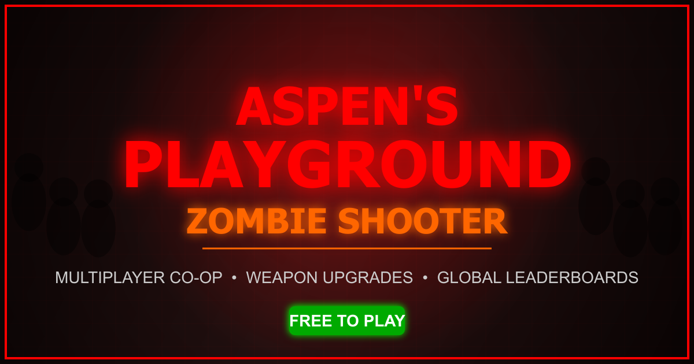

# Aspen's Playground

A 3D multiplayer zombie survival shooter built with Three.js. Survive waves of zombies, upgrade your weapons, customize your character, and compete on global leaderboards.



## Play Now

**Web**: [aspensplayground.com](https://aspensplayground.com)

**Desktop**: Download from [Releases](https://github.com/silencelen/aspensplayground-core/releases)
- Windows (.exe installer or portable)
- macOS (.dmg)
- Linux (.AppImage)

## Features

- **Single-player & Multiplayer Co-op** - Play solo or team up with friends
- **Wave-based Survival** - Face increasingly difficult zombie hordes
- **Multiple Zombie Types** - Runners, tanks, exploders, and bosses
- **Weapon Arsenal** - Pistol, shotgun, SMG, assault rifle, sniper, laser gun, grenade launcher
- **Upgrade System** - Improve damage, fire rate, reload speed, and more between waves
- **Character Cosmetics** - Unlock and equip different player skins
- **Global Leaderboards** - Compete for the highest scores
- **Mobile Support** - Touch controls with virtual joystick

## Tech Stack

- **Frontend**: Vanilla JavaScript, Three.js (WebGL)
- **Backend**: Node.js, Express, WebSocket (ws)
- **Desktop**: Electron
- **Hosting**: GitHub Pages (static), Custom server (multiplayer)

## Development

### Prerequisites

- Node.js 18+
- npm

### Running Locally

```bash
# Install dependencies
npm install

# Start the server
npm start
```

The game runs at `http://localhost:3000`

### Building Desktop App

```bash
cd electron
npm install
npm run build        # Build for current platform
npm run build:win    # Windows
npm run build:mac    # macOS
npm run build:linux  # Linux
```

## Project Structure

```
├── game.js              # Main game client
├── server.js            # Multiplayer server
├── index.html           # Game UI and styles
├── modules/
│   ├── GameCore.js      # Shared game constants and logic
│   ├── maps/            # Map definitions and manager
│   └── ui.js            # UI components
├── maps/                # Map JSON files
├── electron/            # Desktop app packaging
└── .github/workflows/   # CI/CD pipelines
```

## CI/CD Workflows

| Workflow | Purpose |
|----------|---------|
| Deploy to GitHub Pages | Deploys static site on push to main |
| Release Desktop App | Builds executables on version tags |
| Security Audit | npm audit + CodeQL scanning |
| Code Quality | ESLint checks |
| Lighthouse CI | Performance & accessibility audits |
| Bundle Size | Tracks file sizes |
| Compatibility Check | Detects breaking multiplayer changes |

## Contributing

1. Fork the repository
2. Create a feature branch (`git checkout -b feature/amazing-feature`)
3. Commit your changes (`git commit -m 'Add amazing feature'`)
4. Push to the branch (`git push origin feature/amazing-feature`)
5. Open a Pull Request

## Security

See [SECURITY.md](SECURITY.md) for reporting vulnerabilities.

## License

MIT License - see [LICENSE](LICENSE) for details.

## Links

- [Play the Game](https://aspensplayground.com)
- [Download Desktop App](https://github.com/silencelen/aspensplayground-core/releases)
- [Report Issues](https://github.com/silencelen/aspensplayground-core/issues)
- [Privacy Policy](https://aspensplayground.com/privacy.html)
- [Terms of Service](https://aspensplayground.com/terms.html)
